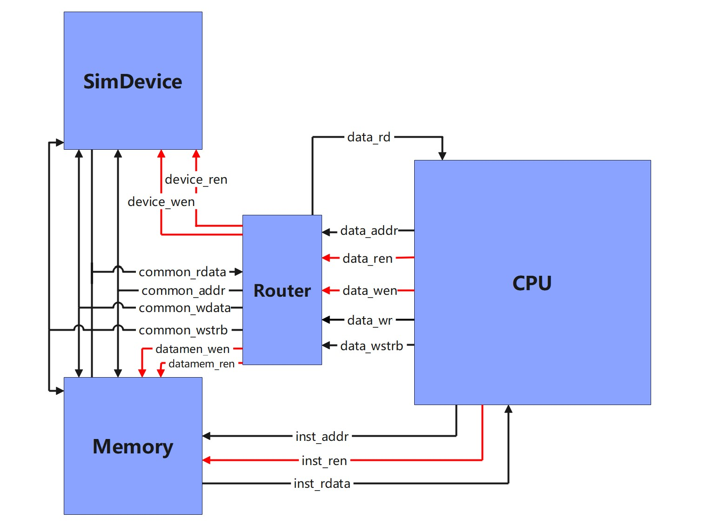

# 外设与内存

> 本文主要讨论minitinyMIPS如何访问外设与内存。

冯诺依曼机由五大部件构成，运算器/数据通路，控制器，存储器，输入输出。本讲主要讨论存储器与输入输出。

本讲的前半部分主要是一些理论知识，介绍内存与外设的访问，并具体针对于mtMIPS的内存与外设系统进行讨论。

在软件程序当中，有着各种各样的简单变量，也有着复杂的数据结构——数组与结构体，这些数据都存放于内存当中。处理器如何访问如此多样复杂的数据呢？

现代的几乎所有的ISA都被划分到了通用寄存器体系结构中。这种指令集架构以通用计算器堆作为运算的中心，数据的来源要么来自于通用寄存器，要么来自于内存。这一分类下的ISA可以被进一步分类，一种是**register-memory ISA**，以x86体系结构为例，其指令集中的很多指令都可以访问寄存器堆，比方说mov指令可以直接将数据从内存当中移动到内存，add指令可以直接将内存数据作为操作数。另一种是**load-store ISA**,这种架构只允许load store指令对存储器进行访问，通过这些指令将数据从内存中加载到寄存器堆当中进行进一步的运算。本课程中使用的MIPS指令集，以及RISC-V指令集，ARM指令集，LoongArch指令集都属于这一类。

> 其实翻阅计算机的发展历史，通用寄存器体系结构并非处理器架构的唯一选择，历史上曾经出现过基于栈，基于累加器的机器，有兴趣的同学可以自行了解

MIPS仅允许load，store指令访问存储器，但是它有非常多的load，store指令。

根据要访问的数据宽度，存储指令store分为`sw`、`sh`、`sb`，分别从内存中写入大小为4字节（**w**ord），2字节（**h**alf word），1字节（**b**yte），对于MIPS64架构中还有`sd`指令（**d**ouble word）。

load指令略有不同，一个小于寄存器宽度的数据（比如half word和byte），载入寄存器后，应该以符号扩展的方式载入还是有符号扩展的方式西载入呢？基于这个属性，load指令比store指令有着更多的分类。包括`lw`,`lh`,`lb`,`lhu`,`lbu`等指令。u的后缀代表unsigned，无符号，意味着当从内存中载入这一一个小于机器字长（寄存器宽度）的数据时，应当采用无符号扩展。相应的没有u后缀的会将从内存中读回的数据进行有符号扩展。

## 外设访问

输入输出是处理器的另一个重要功能。在讨论输入输出之前，我们首先需要了解什么是设备。设备实际上是一种数字电路，其中包含了状态单元，这些状态单元是设备正常运行所需的数据和控制信号。

在日常生活中，我们使用的许多设备都可以被视为设备，例如显示器、鼠标、键盘和硬盘控制器等。这些设备与CPU进行数据和控制信号的交互。CPU通过向设备发送数据和控制信号来指导设备的工作，并通过从设备中读取数据来获取信息。CPU对设备的控制实际上是通过某种方式访问设备上的控制寄存器，设备会解码和解析控制寄存器中的信息，从而指导设备的运行。因此，外设的访问与内存访问类似，需要从某个位置读取数据，向某个位置写入数据。

在处理器架构中，如何找到要读取和写入的位置，如何找到对应的寄存器，涉及到输入输出（IO）编址的问题。

有两种常见的方案用于处理输入输出编址的问题：

1. PMIO（Port-Mapped I/O）方案：将外设视为一种特殊存在，通过独立的编址空间对其进行编址，并使用独立的指令进行访问。在这种方案中，常见的例子是x86架构，它使用IN/OUT指令通过指定端口号来访问相应的设备。

2. MMIO（Memory-Mapped I/O）方案：不区分内存访问和外设访问，将内存和外设统一进行编址。在这种方案中，外设被映射到特定的内存地址空间，通过内存访问指令来对外设进行读写操作。MIPS架构采用了MMIO方式，因此外设的访问也使用前面提到的加载（load）和存储（store）指令。

在MIPS架构中，外设的地址范围被映射到整个32位地址空间的特定段。通过合理地划分地址空间，每个外设都有一个对应的地址范围。当CPU执行访存指令时，如果指令操作的地址落在外设的地址范围内，那么访存操作就会被重定向到相应的外设。

通过MMIO机制，CPU可以使用加载指令从外设读取数据，使用存储指令向外设写入数据。这样，对外设的访问与对内存的访问方式相同，使用相同的指令和地址寻址方式。

因此，在MIPS架构中，MMIO机制将外设与内存统一编址，通过内存访问指令对外设进行读写操作，简化了系统设计和编程过程，使得处理器可以通过统一的方式与外设进行交互。这样的设计方案使得处理器能够更加灵活地与各种外设进行通信和控制。

## mtMIPS的访存与外设系统

mtMIPS的整体结构图如下图所示。可以看到，CPU的访存需求一共有两类，一类是指令的访存请求，一类是数据的访存请求。其中，数据的访存请求被连接到了Router模块。Router模块相当于一个总线控制器，总线上挂载着设备SimDevice，和内存Memory，Router需要根据访存的地址确认具体的访存请求时发送到设备还是内存，给对应模块发起访存请求。下面我们分别介绍访存系统中的三个模块的基本功能。



### Memory模块

Memory模块是一个内存模块，由于处理器每个周期最多会进行一次数据访存和一次指令访存，如果我们设计的存储器只有一个端口，就会导致处理器执行load指令时出现停顿，因为当前指令的取指和访存请求同时到达，而读口只有一个，一个周期内只能处理一条指令，这就会导致该任务无法在单周期内完成。

本设计当中，设置了两个读口，分别支持指令访存和数据访存。同时仅设计了一个写口，因为只有数据访存会有写入的请求。

Memory是一个单周期返回结果的存储器，其设计类似于处理器的寄存器堆。

!> 关于Memory的写入，当前的设计并不支持根据wstrb写入Memory的对应位，如果你需要实现`sb`指令和`sh`等指令，你需要对Memory的模块进行修改，增加对于写掩码的支持，框架中已经给出部分代码。

### SimDevice

!> SimDevice位于Simulation下的`SimDevice.v`文件，而不是Memory下的`Device`文件

SimDevice模块是一个模拟串口的外设。当Router模块向其发起写入请求时，SimDevice模块会检测输入的地址。如果地址是模拟串口的地址，该模块会调用fwrite函数，将输入的数据以ASCII码的形式打印出来。

下面是SimDevice模块的Verilog代码：

```verilog
module SimDevice(
    input  wire clk,
    input  wire rst_n,
    input  wire [ 31 : 0 ]  addr,
    input  wire             ren,
    output wire [ 31 : 0 ]  rdata,
    input  wire [ 31 : 0 ]  wdata,
    input  wire             wen,
    input  wire [  3 : 0 ]  wstrb 
);
    // 模拟串口的地址
    parameter STDOUT = 32'h8000_0001;
    parameter UART_ADDR = 16'h03f8;
    
    always @(posedge clk) begin
        if (wen && addr[15:0] == UART_ADDR) begin
            $fwrite(STDOUT, "\033[1;34m%c\033[0m", wdata);
        end
    end

endmodule
```


SimDevice模块具有以下输入输出端口：
- 输入端口：
  - clk: 时钟信号
  - rst_n: 异步复位信号
  - addr: 地址输入信号
  - ren: 读使能信号
  - wdata: 写数据信号
  - wen: 写使能信号
  - wstrb: 写数据掩码信号

- 输出端口：
  - rdata: 读数据输出信号

SimDevice模块通过检测输入地址和使能信号，判断是否需要进行串口打印操作。如果写使能信号wen为高电平且输入地址addr的低16位等于UART_ADDR（模拟串口的地址），则该模块会调用fwrite函数将写入的数据wdata以ASCII码形式打印出来。在时钟的上升沿触发的always块中，对写使能信号wen和输入地址addr进行判断，并执行相应的操作。

?> 为什么是低16位？某种程度上，这是个Bug，但是这也是个后门，你可以选择修复它，利用它，或者不管它。

通过SimDevice模块，可以模拟对串口外设的访问，实现将写入的数据以ASCII码形式打印的功能。

!> 使用Windows的同学请注意接下来的提示框！
> 串口使用了使用以下的代码进行实现
>
> ```
> $fwrite(STDOUT, "\033[1;34m%c\033[0m", wdata);
> ```
>
> 这段代码仅在支持ANSI转义的命令行中可用，正常情况下通过该函数输出的字符会是蓝色
> 
> 但是，对于使用Windows的同学，该功能时无法正常运行的，所以，请将代码修改为
>```
>$fwrite(STDOUT, "%c", wdata);
>```


### Router

`Router`就是一个接收处理器访存请求并将其发送到相应设备的装置。

在之前学习了[外设访问](#外设访问)后，我们已经了解到`MIPS`处理器采用了`MMIO`的方式，因此，有些请求是发送给外设，而有些请求是发送给内存的。我们需要一个模块来将访存请求路由到相应的位置上。

`Router`可以被看作一个简单的总线控制器，挂载的设备统一连接到总线的数据信号上，包括`common_addr`、`common_wdata`、`common_wstrb`等信号，这些信号连接到每个挂载在总线上的设备上。但对于每个设备，还有额外的控制信号，用于控制读写操作的使能，比如设备具有独立的控制信号`device_wen`和`device_ren`。`Router`的主要工作就是根据`CPU`发送的地址，给这些独立的控制信号以使能。

图中将`SimDevice`和`Memory`的读数据端口挂在同一条数据线`common_rdata`上，如果采用共用`common_rdata`的方式，就需要使用三态门进行控制。但是在`FPGA`上，通常会使用选择器来实现这种设计。因此，在实际的框架代码中，我们将`SimDevice`和`Memory`分别连接了一个`rdata`信号，在`Router`内部，我们会根据访存请求的地址，对`rdata`进行选择，选择合适的返回数据，返回给CPU。
图中将`SimDevice`和`Memory`的读数据端口挂在同一条数据线`common_rdata`上，如果采用共用`common_rdata`的方式，就需要使用三态门进行控制。但是在`FPGA`上，通常会使用选择器来实现这种设计。因此，在实际的框架代码中，我们将`SimDevice`和`Memory`分别连接了一个`rdata`信号，在`Router`内部，我们会根据访存请求的地址，对`rdata`进行选择，选择合适的返回数据，返回给CPU。

在`MIPS`中，外设留给的地址段是`0xa0000000-0xbfffffff`。因此，`Router`可以通过地址的高位对`CPU`发送的访存请求进行判断，将落在`0xa0000000-0xbfffffff`范围内的访存请求发送给`SimDevice`，并将相应的`device_wen`和`device_ren`置为使能。其他情况下，这些信号将被置为非使能状态。
在`MIPS`中，外设留给的地址段是`0xa0000000-0xbfffffff`。因此，`Router`可以通过地址的高位对`CPU`发送的访存请求进行判断，将落在`0xa0000000-0xbfffffff`范围内的访存请求发送给`SimDevice`，并将相应的`device_wen`和`device_ren`置为使能。其他情况下，这些信号将被置为非使能状态。

!> 注意，发给设备的请求不能再同时发给内存，请注意修改内存的控制信号

---

## 访存实验说明

为了让大家简单的试用虚拟串口，我们在asm-test中给出了一段可以输出Hello-world的汇编代码，大家可以通过运行这段汇编代码，从而让处理器通过虚拟串口输出Hello，world

为了完成这个实验，在处理器核部分完成的六个实验的基础上，你还需要以下部分的修改

* 将asm-test中的文件进行编译，获取对应的`mem.data`文件，具体参考[环境使用指导](/miniminimips/env)

	> 如果实验环境上有困难可以考虑找同学要一份。

* 修改Router，正确的给出访存指令

* 实现lui指令，ori指令

  > 为了正确理解为什么在MIPS架构中需要使用`lui`指令和`ori`指令来加载地址0xa00003f8这样的立即数，我们需要了解MIPS指令格式的限制。
  >
  > 在MIPS指令集中，指令被编码成特定的格式，其中I格式用于表示立即数和寄存器之间的操作。然而，I格式中的立即数字段位数是有限的，通常为16位。这意味着一条指令无法直接加载一个32位的立即数。
  >
  > 在汇编代码中，当我们需要加载地址0xa00003f8这样的32位立即数时，我们使用了`li`伪指令。作为一条伪指令，汇编器在编译该指令时会将其转换成其他实际的指令，`li`指令在加载超过16位的立即数时会被拆分为`lui`和`ori`两条指令，以克服指令格式的限制。
  >
  > 具体而言，`lui`指令用于将16位的立即数加载到目标寄存器的高16位，而`ori`指令用于将另一个16位的立即数加载到目标寄存器的低16位，并与目标寄存器的高16位进行逻辑或操作，以得到完整的32位地址。
  >
  > 因此，通过使用`lui`指令和`ori`指令的组合，我们能够克服MIPS指令格式的限制，正确地将地址0xa00003f8加载到寄存器中，以便在后续的访存操作中使用。这种组合使用的方式可以实现加载大于16位的立即数值，从而满足对于32位地址的需求。
