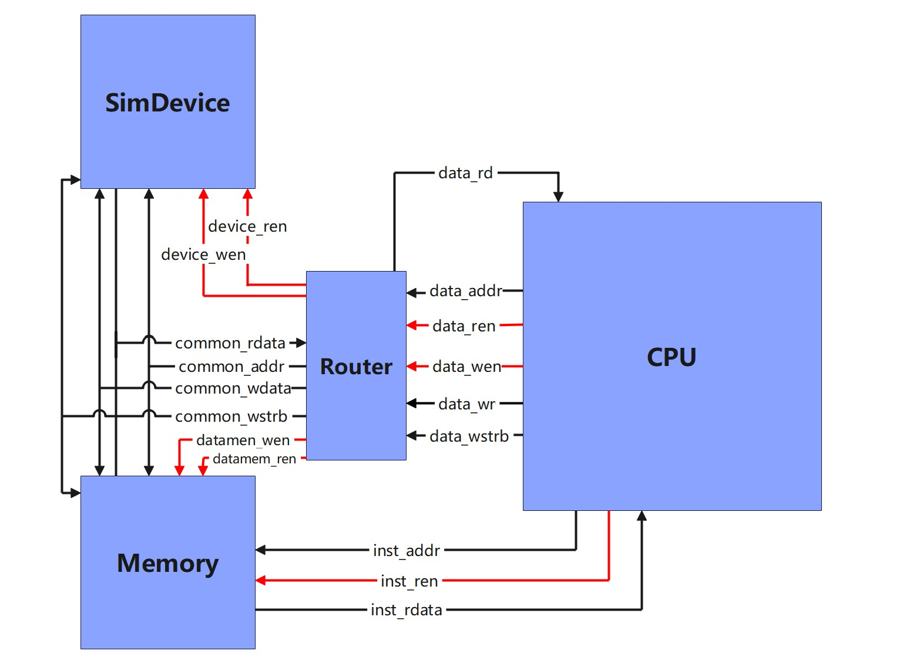
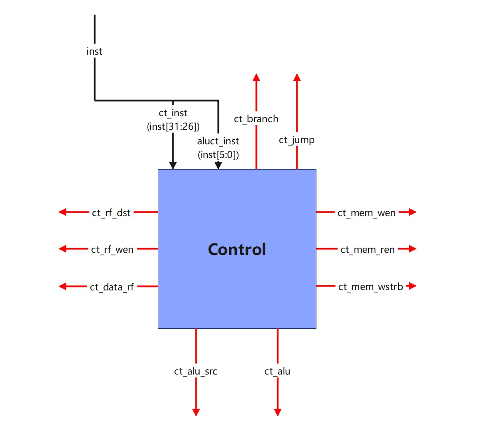

 

 

## 前言

本书从计算机科学与技术专业教学指导委员会发布的计算机组成原理课程设计的大纲出发，重点介绍了单周期MIPS处理器的设计思路与实现步骤；并用Verilog语言实现了该处理器的8条指令，希望起到抛砖引玉的作用。学生可在此基础上发挥自己的潜能，自行设计完成计算机组成原理课内实验与课程设计。

本手册可供学过数字逻辑课程的相关专业的同学在计算机组成原理课程实验中参考使用。对于没有开设数字逻辑课程的专业可选择使用。

由于前两章在数字逻辑课程中已经介绍，在此不再做介绍，直接进入单周期MIPS处理器设计章节。

在编写过程中，得到了张晓彤老师和刘宏岚老师的大力支持，并提供了很多宝贵的意见；宛嵇祥、张培、赵雪松等同学为本指导书的编写也做了大量工作，在此一并表示感谢。

作者希望本书内容能引起对CPU和复杂数字逻辑系统设计有兴趣的电子工程师们的注意，加入我国集成电路的设计队伍，提高我国电子产品的档次。

由于作者的经验与学识有限，不足之处敬请读者批评、指正。

编者

2018年4月

# 第一章Vivado开发平台及应用介绍（略）

# 第二章 硬件描述语言Verilog介绍（略）

# 第三章 单周期CPU设计与实现

## 3.1 指令系统

MIPS指令集优点：

①  指令集采用32-bit编码，因为指令长度相同，能够降低译码的复杂度，减少译码延迟，并能很容易的使用流水线来提高处理器的效率。

②  设计的嵌入式处理器只有load和store指令对存储系统进行访问。简单的指令寻址方式简化了嵌入式微处理器控制器和数据通路的设计。

③  处理器采用通用寄存器组结构，在这种结构中，指令可以从寄存器堆读出操作数，并将执行的结果回写到寄存器堆中。

 

MIPS指令集分类：


**图1 Mips三种不同的指令类型**

 


**图2 指令字段说明**

 

1.  算数逻辑指令，可能是R型或I型指令，例如addu(无符号加法)，addiu （无符号立即数加法）。

2. 存储访问指令，用于存取存储器，指令格式与I型指令相同，意义不同, 例如lw(加载一个word)，sw(存储一个word)。

3. 分支和跳转指令，能改变程序的执行过程，可能是J型或I型指令，例如j(跳转)，beq（相等跳转）。

4. 协处理器及其CPO指令，和专用指令，未予实现。 

根据指令类型，至少需要实现三种寻址方式： 

1. 寄存器寻址：源操作数或目的操作数为寄存器的指令，主要有R型指令，I型指令，通过指明寄存器号来读取操作数，例如addu，addiu。

2. 基址加偏移寻址：寄存器与偏移量相加得到地址，例如lw，sw。

3. PC相对寻址：PC与地址偏移相加得到地址，例如beq，j。


**图3 指令寻址方式**

 

寄存器结构采用标准的32位寄存器堆，共32个寄存器，标号为0-31。其中第0寄存器永远为全0，第31寄存器是跳转链接地址寄存器。它在链接型跳转指令下会自动存入返回地址值。对于其它寄存器，可由软件自由控制。


**图4 MIPS的规范中寄存器含义**


以MIPS指令系统的简化版本为例，在简化版本中，实现如下指令：


**图5 指令的语法、格式、功能**

## 3.2 设计

### 3.2.1 minitinyMIPS整体架构

minitinyMIPS整体上划分为处理器核与内存外设两大部分，本讲义主要介绍其中的处理器核部分



### 3.2.2 处理器核顶层设计

分析指令构建所需的数据通路：

1. IFU(取指令模块)通过指令访问总线向内存发起访存请求，读回指令，访存的地址存储在一个32位的寄存器中，用于记录当前程序执行到的位置，该寄存器称为pc（Program Counter）寄存器，每个周期变化，指向下一条需要执行的指令。

2. addu指令：addu rd,rs,rt，将rs寄存器中的值和rt寄存器中的值相加存入rd寄存器中。加法操作要将从RegFile(寄存器堆模块)取出的两个操作数送到ALU（算数逻辑单元）模块运算。

3. addiu指令：addiu rt,rs,imm，将rs寄存器中的值和imm(立即数) 符号扩展后的值相加存入rt寄存器中。对比addu，addiu，它们都执行加法，有一个操作数都是来自rs寄存器，但另一个操作数addu是来自rt寄存器，addiu则是来自指令中的立即数。所以在数据通路中需要一个选择器区分。

4. lw指令：lw rt,offset(rs)，将rs寄存器中的值加上offset符号扩展后的值作为地址在DataMem(数据存储器模块)中找到数据存入rt寄存器。
5. sw指令：sw rt,offset(rs)，将rt寄存器中的值存入内存，地址为rs寄存器中的值加上offset符号扩展后的值。
6. beq指令：beq rs,rt,offset，比较rs和rt寄存器中的值，如果相等pc就跳转到地址为(符号扩展)(offset<<2)+(pc)+4处，如果不相等pc就不发生跳转。
7. j指令：j target，pc跳转到target左移两位后替换pc低28位的地址处。

综上所述设计数据通路，分为包含控制取值信号的IFU模块，包含寄存器堆及其读写的RegFile模块，包含算术和逻辑运算的ALU模块，包含读写控制、选择器控制、操作方式控制的Control模块，**以下的模块关系分析省去了时钟和复位信号。**


**图 6 IFU模块**

有了模块的划分以后开始分析模块的关系，IFU的功能就发出取值访存请求取回指令，所以它的输出就是当前程序的pc值。在程序顺序执行时，一条指令执行结束后会执行其后的一条指令，每条指令的宽度为4字节，因此在顺序执行指令的条件下PC寄存器每周期增加4

然而存在beq和j这一类指令，当执行完成该指令后，下一条指令的地址由该指令决定，因此，我们需要将指令的地址作为输出，同时加入分支指令与跳转指令的控制信号，从而实现程序的分支跳转功能。


**图 7 RegFile模块**

RegFile是寄存器文件模块，是处理器中一块暂存数据的高速存储器。该模块需要根据地址读出或写入数据。

读操作一次读出两个寄存器的值，它们的地址分别为指令的rs，rt字段，对于不同的指令不做区分，对于那些不需要的数据搁置不理。

写操作的地址不同的指令不相同，可能是rd字段，也可能是rt字段。例如addu指令写寄存器堆的地址为指令的rd字段，而addiu指令写寄存器堆的地址为指令的rt字段，所以需要一个选择器进行区分，Control模块给出选择器的控制信号ct_rf_dst。要保证数据在合适的时候写入寄存器，写操作需要Control模块给出一个写使能信号ct_rf_wen。

写操作的写入数据对于不同的指令也不同，可能来自ALU的运算结果alu_res,例如addu指令要写回寄存器堆的数据就是ALU的运算结果，也可能来自DateMem模块的输出mem_data_o，例如lw指令就是从DataMem将数据加载到寄存器堆，所以也需要一个选择器区分写入数据的来源，由Control模块给出选择器的控制信号ct_data_rf。


**图 8 ALU模块（略去了之前介绍过的模块）**

 ALU模块负责进行数据运算，其主要功能有二，其一是对输入的两个数据进行各类的运算，其二是根据需要进行的运算类型，在各类运算结果中进行选通。

要区分进行何种运算就需要输入一个选择信号，它来自Control，这里我们选4bit的信号，4bit意味着可以编码16种运算，如果后续在扩展过程中需要实现的运算超过16种，可以通过扩展该信号的位宽。

输入的两个数据源中，其中一个直接来自寄存器堆读出的数据rf_data_r1，另一个可能来自寄存器的堆的输出，例如addu指令两个数据源都是从寄存器堆中读出的，还有可能来自指令的低16位符号扩展为32位的结果，例如addiu指令一个数据源来自寄存器堆，另一个数据源则是指令中的立即数符号扩展的结果，所以要通过一个选择器区分数据的来源，由Control模块给出选择器的控制信号ct_alu_src。ALU的输出除了运算结果还应该有一些标志信号用于判断特殊运算结果，例如分支指令beq的分支条件(rs)-(rt)是否为0，这个为0的标志信号alu_zero就是由ALU模块送到IFU的。


**图9 数据访存信号组**


数据访存信号组主要用于数据内存的读取与访问，直接连接到外部的Router模块，该模块的具体介绍参见另一篇外设与内存的文档。当前不需要考虑太多，只需要把Router模块当成一个存储器即可（实际上Router是对设备与内存的代理，本身并非存储器）。

处理器对内存和外设的读操作与写操作共用同样的地址信号`data_addr`,`data_ren`和`data_wen`为读写操作的使能信号，`data_rd`为访存读回的数据，`data_wr`当写操作执行时要写入的数据，`data_wstrb`是写掩码，掩码的每一位对应着写入数据的一个字节，比方说`data_strb[0]`对应着`data_wr[7:0]`，当掩码对应位有效时，对应的字节才会被写入到存储器或外设寄存器当中。

> 旧版的实验书当中，数据内存由一个称为DataMem模块来实现，DataMem模块目前被改名为Memory模块，并且与指令内存完成合并，挪到了处理器核外，同时增加了Router作为访存请求的代理，DataMem模块与Memory的模块多有不同，感兴趣的同学可以对比二者的实现，看看二者的异同



**图10 Control模块**

Control模块的功能是根据指令的功能产生对应的控制信号，包括对于ALU，IFU，外部存储等。指令的功能由指令的opcode段（指令高6位），以及当指令为R型指令时的，其低6位的funct段可以进一步区分指令的功能类型。

Control的输入是指令的opcode段和funct段，输出是本节之前提到的所有控制信号。最高六位用于区分不同的指令，最低六位用于区分R型指令的不同操作，因为需要运算的不光有R型指令，所以将指令低六位和由Control模块根据不同指令生成的2bit的ct_alu_op控制信号一起送入子模块ALUCt(ALU控制，图上未画出)，ALUCt返回4bit的ct_alu信号由Control模块输出。

 

**图 10 顶层设计图，接口名字不做限制，省略了时钟与复位信号**

经过设计分析最终得出了模块之间的连接关系图也就是顶层模块，单周期MIPSCPU已经有了雏形，接下来将具体的看一看每一个模块的内部实现。

#### 3.2.2 模块设计

**内存模块**

程序放在内存当中，处理器会自动的从内存中取出指令并执行，这就是冯诺依曼结构存储程序的思想。

在本实验中，我们的存储器采用了冯诺依曼结构，又称为普林斯顿结构，指的是将指令与数据混合的存储在同样的内存当中的方式。传统的冯诺伊曼结构存储器中，指令与数据共用一个存储器，共用一条总线，这也就意味着，数据访存与指令访存不能同时进行，因为二者出现了结构冲突，在本实验中，我们虽然采用了一个存储器，但我们提供了两条访存总线，指令和数据的访存操作分别使用不同的总线，从而保证在单周期的限制条件下可以同时取值和进行数据操作

存储器采用字节编址的方式。所谓字节编址，是指存储器中，每一个字节都有一个属于自己的地址用于标识它。当我们要索引更大的数据单元时，事实上是通过这个更大的数据单元中的某一个字节的地址对其进行索引。

存储器采用了小端序的方式。一般将小端的MIPS指令称为mipsel与大端序MIPS区分。以数据0x0A0B0C0D为例，如果起始地址是0x0，内存单位是8bit，那么在大端序情况下，低地址存放高位，即0x0地址存放0x0A，0x1地址存放0x0B，0x2地址存放0x0C，0x3地址存放0x0D；小端序是低地址存放低位，0x0地址存放0x0D，0x1地址存放0x0C，0x2地址存放0x0B，0x3地址存放0x0D。

为了让指令能够在当周期读回，当前实验环境中提供的内存模块，其任意时刻的数据总是与给出的地址对应，符合单周期CPU的要求。

> 实际中使用的存储器，往往会在给出地址以后，经过若干个周期后才能获取到所需要的数据。
>
> 访问内存所需要的成本在实际的处理器中相当高昂，需要耗费大量的处理器周期才能读回结果，现代处理器中为了降低访存的代价，采用高速缓存来降低访问内存的频率，从而提升处理器的效率。

在实验的仿真环境中，我们通过`$readmemh`来将要运行的指令预置在存储器当中，该函数的功能是从指定文件读取数据初始化寄存器的内容。读取的数据文件的内容只能包含：空白位置(空格，换行，tab和form-feeds)，注释行(//)，十六进制的数字。


**mem.data文件内容**


执行`$readmemh("mem.data",mem_file)`后 的 `mem_file`

另外这个文件的位置也要注意。在Vivado中执行仿真时，“当前目录”并不是工程的根目录：如果工程名字是soc，那么行为仿真时的“当前目录”实际上位于“soc\soc.sim\sim_1\behav\xsim”文件夹。时序仿真等和这个类似，但是文件夹不一样。注意创建工程后并没有上述文件夹，需要先执行一遍对应的仿真（让Vivado创建对应的目录），然后把写好的数据文件放到对应目录。直接写出数据文件的绝对地址也可以，但是将工程复制到其他电脑上时要注意修改路径。

`$readmemh`只接受十六进制的数据。另外一个类似的函数`$readmemb`接受二进制的数据，语法和前者类似。

**IFU模块：**

IFU（Instruction Fetch Unit，取指单元）模块的功能就是从内存中取出指令。

另外这个文件的位置也要注意。在Vivado中执行仿真时，“当前目录”并不是工程的根目录：如果工程名字是soc，那么行为仿真时的“当前目录”实际上位于“soc\soc.sim\sim_1\behav\xsim”文件夹。时序仿真等和这个类似，但是文件夹不一样。注意创建工程后并没有上述文件夹，需要先执行一遍对应的仿真（让Vivado创建对应的目录），然后把写好的数据文件放到对应目录。直接写出数据文件的绝对地址也可以，但是将工程复制到其他电脑上时要注意修改路径。

IFU第一条指令从地址为0x8000_0000处取指。

如果执行的指令是跳转指令，例如jump指令。指令格式如下，需要执行的操作是PC={PC[31:28], address, 2'b00}。


如果执行的是分支指令，且满足条件，需要执行的操作是$PC=PC+4+(立即数<<2)$。

如果不是上述两种情况，那么$PC=PC+4$。

据此完成IFU模块的实现代码：

```verilog

module IFU(
    input wire clk, rst_n,
    input wire alu_zero, ct_branch, ct_jump,
    output reg [ 31 : 0 ] pc,
    input wire [ 31 : 0 ] inst
);
	
    reg  [ 31 : 0 ] npc;

    wire [ 31 : 0 ] jump_addr, branch_addr, linear_addr;
    assign linear_addr = pc + 4;
    assign jump_addr = 0;
    assign branch_addr = 0;

    always @(*) begin
        if(ct_jump)begin                
            npc = jump_addr;
        end else if(ct_branch && alu_zero) begin
            npc = branch_addr;
        end else begin 
            npc = linear_addr;
        end
    end
    always @ (posedge clk)begin
        pc <= npc;
        if(!rst_n)begin
            pc <= 0;
        end
    end
endmodule
```

**RegFile模块：**

MIPS的寄存器堆是32个32位的寄存器。在单周期CPU设计中，我们希望能在给出地址的同时就能在出口得到对应的数据；考虑到MIPS指令中很多指令都要求`rs`、`rt`两个参数，所以我们的寄存器堆设计为具有两个读端口、一个写端口：


其中，`ct_rf_wen`是写信号。在时钟的下边沿，寄存器堆会检查这个信号。如果它为1，那么就将`rf_data_w`的32比特数据写入`rf_addr_w`表示的寄存器。余下的四个信号是读取地址和数据输出端口，地址为5位（$2^5=32$）,数据输出为32位。

代码如下(**图中接口名是顶层模块连接时的名字与模块内部不一定一样**)：

```verilog
module RegFile(  
    input  wire clk,  
    input  wire rst_n,
    // 写使能信号  
    input  wire rf_wen,  
    // 读地址  
    input  wire [  4 : 0 ] rf_addr_r1,  
    input  wire [  4 : 0 ] rf_addr_r2,  
    // 写入地址和写入数据  
    input  wire [  4 : 0 ] rf_addr_w,  
    input  wire [ 31 : 0 ] rf_data_w,  
    // 输出端口  
    output wire [ 31 : 0 ] rf_data_r1,  
    output wire [ 31 : 0 ] rf_data_r2  
);  
      
    reg[ 31 : 0 ] file [ 31 : 0 ];  
     
    assign rf_data_r1 = file[rf_addr_r1];  
    assign rf_data_r2 = file[rf_addr_r2];  
    
    integer idx;
    initial begin
        for (idx = 0; idx < 32; idx = idx + 1) file[idx] = 0;
    end 
    genvar i;
    generate
        for (i = 0; i < 32; i = i + 1)begin
            always@(posedge clk) begin                   
                //在此补充完成控制信号控制寄存器堆写操作
                if (!rst_n) begin
                    file[i] <= 32'b0;
                end  
            end
        end  
    endgenerate
endmodule  

```

**ALU模块：**

ALU主要用来执行加减法、比较等指令。在单周期CPU中只要求实现在一个时钟周期能够完成的指令，所以我们将ALU设计为不受时钟控制的组合逻辑电路，也就是说在任意时刻，ALU的输出总是与此时的输入和控制信号相对应。

首先我们来分析指令结构。ALU参与的指令主要有R型和I型：在R型指令中，op和funct两段确定了ALU执行的操作；在I型指令中则是由op来确定。将这两个信号传递给控制器，然后指示ALU模块做什么运算。这样我们就得到了一个简单的ALU通路。下面是ALU的设计图：


rf_data_r1和alu_src2是ALU的两个操作数，alu_res表示运算结果，alu_zero用于表示结果是否为0。aluct_sel信号指示ALU执行什么样的操作。aluct_sel的取值可以自由确定，属于实现细节。下面给出一个控制信号表样例：

 

| 指令inst[31:16] | aluct_sel |      |
| --------------- | --------- | ---- |
| addu(000  000)  | 0010      | 加法 |
| lw(100  011)    | 0010      |      |
| sw(101  011)    | 0010      |      |
| addiu(001  001) | 0010      |      |
| beq(000  100)   | 0110      | 减法 |

 

beq指令在两个输入相等时跳转，我们可以用减法来模拟：如果两个数相等，那么alu_zero就是1。将alu_zero接入IFU模块，配合其他控制信号，就可以实现跳转功能。

注意到上表中还出现了lw和sw两个指令。以sw为例，它的格式是：

**1010 11ss ssst tttt iiii iiii iiii iiii**

其作用是将\$t寄存器的内容写入MEM[$s+offset]，offset是后16位确定的偏移量。注意到内存地址做了一个加法，所以我们可以将sw也看作一个“加法指令”，它的结果alu_res连接到内存的地址输入端。通过控制器的控制信号，我们就可以实现用ALU计算出目标地址，然后将寄存器的内容写入到内存中去。这样设计可以节约一个专门用于计算地址的模块。lw也是一样的原理，具体的数据流向是由控制器确定的。

结合Control模块部分的介绍，补充完整ALU模块代码：

```verilog
module ALU(
    input  wire [  3 : 0 ] alu_ct,
    input  wire [ 31 : 0 ] alu_src1,alu_src2,
    output wire            alu_zero,
    output reg  [ 31 : 0 ] alu_res
);
    assign alu_zero= (alu_res==0)?1:0;
    always@(*)
        case(alu_ct)
            //在此补充代码：当alu_ct为4'b0010，执行加法运算；为4'b0110时，执行减法运算。
            default:begin end
        endcase
endmodule
```

**Control模块：** 


Control模块内部还包含负责控制ALU的子模块ALUCt， 复位信号、指令的0-5位funct字段和2bit的ct_alu_op作为内部信号送到子模块ALUCt中，ALUCt返回4bit的ct_alu信号由Control模块输出。

据此补充完整ALUCt模块实现代码：

```verilog
module ALUCt(
    input  wire [ 5 : 0 ] funct,
    input  wire [ 1 : 0 ] alu_ct_op,
    output reg  [ 3 : 0 ] alu_ct
);
    always@(*) begin
        case(alu_ct_op)
            2'b00:
                alu_ct= 4'b0010;
            2'b01:
                alu_ct= 4'b0110;
            2'b10:
                case(funct) 
                    //在此补充代码：当指令中funct段为100001时，alu_ct输出4’b0010（执行加法操作）。

                    default:begin 
                        alu_ct = 4'b0000;
                    end
                endcase
            default:begin end
        endcase 
    end
endmodule
```

通过看数据通路设计图，可以知道Control模块的功能是根据指令的高六位（指令类型，例如R型指令、lw指令）和指令的低六位产生各个模块的控制信号。Control模块对各个模块产生的控制信号及作用如下：

| 模块       | 控制信号   | 作用                                            |
| ---------- | ---------- | ----------------------------------------------- |
| IFU        | ct_jump    | 执行跳转指令时变为有效信号                      |
| IFU        | ct_branch  | 执行分支指令时变为有效信号                      |
| 访存信号组 | ct_mem_wen | 对内存发起写请求时变为有效信号                  |
| 访存信号组 | ct_mem_ren | 对内存发起读请求时变为有效信号                  |
| ALU        | ct_alu     | 选择ALU要执行的运算，例如选择执行加法或其他运算 |
| Mux        | ct_alu_src | 二选一多路选择器的控制信号                      |
| Mux        | ct_rf_dst  | 二选一多路选择器的控制信号                      |
| Mux        | ct_data_rf | 二选一多路选择器的控制信号                      |
| RegFile    | ct_rf_wen  | 往RegFile写入数据数据时变为有效信号             |

以R型指令为例，讲解各个控制信号的变化。当输入一条指令时，首先应该识别该指令的类型。识别的方法如下：

指令的高6位是标明了指令类型。R型的指令高六位是ct_inst[5:0]=6’b000000，定义一个变量inst_r,令inst_r=(!ct_inst[5])&&(!ct_inst[4])&&(!ct_inst[3])&&(!ct_inst[2])&&(!ct_inst[1])&&(!ct_inst[0])当指令为R型时，inst_r=1,当指令不是R型时，inst_r=0.其余指令的识别方法可以此为参考。

此时已经知道指令为R型。我们要执行的操作是(rd)=(rs)《运算符》(rt).首先需要执行的操作是在RegFile模块中读取rs、rt寄存器中的数据，RegFile模块不需要读使能信号，所以Control对这一步骤不需要控制，然后是将读到的两个数据放入ALU中。


从图上可以看出，rs寄存器数据直接放入ALU中，但是rt寄存器数据需要经过二选一多路选择器，才能放入ALU中。所以当检测到指令是R型指令时，将`ct_alu_src`设置为0，这样我们便可以选中rt寄存器中的数据进入ALU。

两个源数据进入ALU后。紧接着ALU要进行运算。ALU执行何种运算需要`ct_alu`信号的控制。`ct_alu`信号的设置方法如下：

R型指令执行的运算类型需要依据指令的低六位funct[5:0]来判断。在Control模块内用一个专门的模块ALUCt来产生`ct_alu`信号。将指令的0-5位funct字段和2bit的`ct_alu_op`作为内部信号送到子模块ALUCt中作为`ct_alu`信号的判断依据。使用`ct_alu_op`信号来标明当前指令的种类。通过`ct_alu_op`信号判断指令为R型，需要进一步判断funct段，如果funct段标明要执行加法运算。给`ct_alu`赋值为4’b0010，控制ALU进行加法运算。

ALU执行之后，需要将ALU的运算结果通过二选一多路选择器放入到寄存器rd。


从上图可以看出，需要将数据选择控制信号`ct_data_rf`设置为0，选中ALU的运算结果。将地址选择控制信号设置为1，选择rd寄存器的地址。

对于Control产生的其他外部控制信号，因为这条指令的执行不需要用到其余的操作，所以都设为无效信号0。

据此补充完整控制模块Control的代码：

```verilog
module Control(
    input  wire  [  5 : 0 ] ct_inst,
    input  wire  [  5 : 0 ] aluct_inst,
    output wire             ct_rf_dst,
    output wire             ct_rf_wen,
    output wire             ct_alu_src,
    output wire  [  3 : 0 ] ct_alu,
    output wire             ct_mem_wen,
    output wire             ct_mem_ren,
    output wire  [  3 : 0 ] ct_mem_wstrb,
    output wire             ct_data_rf,
    output wire             ct_branch,
    output wire             ct_jump
);
    wire inst_r, inst_lw, inst_sw, inst_beq, inst_j, inst_addiu;
    wire[1:0] ct_alu_op;
    ALUCt aluct0(
        .funct(aluct_inst),
        .alu_ct_op(ct_alu_op),
        .alu_ct(ct_alu)
    );
    //二级逻辑阵列
    //与阵
    assign inst_r  = (!ct_inst[5])&&(!ct_inst[4])&&(!ct_inst[3])&&(!ct_inst[2])&&(!ct_inst[1])&&(!ct_inst[0]);
    //在此补充完整其余5条指令inst_lw，inst_sw，inst_beq， inst_j，inst_addiu的表达式。
    
    //或阵
    assign ct_rf_dst = inst_r;
    assign ct_rf_wen = inst_r || inst_lw || inst_addiu;
    assign ct_alu_src = inst_lw || inst_sw || inst_addiu;
    assign ct_alu_op = {inst_r,inst_beq};
    assign ct_mem_wstrb = 4'b1111; // 当前只实现sw指令，所以wstrb各位均为1，那么，如果要增加sb，sh指令，又该如何处理呢
    //在此补充完整其余控制信号的表达式：ct_branch, ct_mem_ren, ct_mem_wen, ct_data_rf, ct_jump
    
endmodule
```

CPU顶层模块

综合上述模块，可分析出顶层模块CPU的实现如下：

 ```verilog
 `timescale 1ns / 1ps
 module CPU(
     input  wire             clk,
     input  wire             rst_n,
     output wire  [ 31 : 0 ] inst_addr,
     output wire             inst_ren,
     input  wire  [ 31 : 0 ] inst,
     output wire  [ 31 : 0 ] data_addr,
     output wire             data_ren,
     input  wire  [ 31 : 0 ] data_rd,
     output wire             data_wen,
     output wire  [ 31 : 0 ] data_wr,
     output wire  [  3 : 0 ] data_wstrb
 );  
     wire [31:0] pc;
     //Contol模块输出的控制信号
     wire        ct_rf_dst,ct_rf_wen,ct_alu_src,ct_data_rf,ct_branch,ct_jump;
     wire        ct_mem_wen,ct_mem_ren;
     wire [ 3:0] ct_mem_wstrb;
     wire [ 3:0] ct_alu;
     //RegFile模块的输入输出
     wire [ 4:0] rf_addr_w;
     wire [31:0] rf_data_r1,rf_data_r2,rf_data_w;
     //ALU模块的输入输出
     wire        alu_zero;
     wire [31:0] alu_src2;
     wire [31:0] alu_res;
     //符号扩展的结果
     wire [31:0] ext_data;
     //DataMem的输出
     wire [31:0] mem_data_o;
     //选择要写的寄存器地址  
     assign rf_addr_w = ct_rf_dst ? inst[15:11] : inst[20:16];
     //选择要写入寄存器堆的数据
     assign rf_data_w = ct_data_rf ? mem_data_o : alu_res;
     //alu_src2是指令后16位符号扩展的结果或者寄存器堆读的第二寄存器的值
     assign ext_data = {{16{inst[15]}}, inst[15:0]};
     assign alu_src2 = ct_alu_src ? ext_data : rf_data_r2;
     
     IFU ifu0(
         .clk(clk),
         .rst_n(rst_n),
         .alu_zero(alu_zero),
         .ct_branch(ct_branch),
         .ct_jump(ct_jump),
         .pc(pc),
         .inst(inst)
     );
     Control ct0(
         .ct_inst(inst[31:26]),
         .aluct_inst(inst[5:0]),
         .ct_rf_dst(ct_rf_dst),
         .ct_rf_wen(ct_rf_wen),
         .ct_alu_src(ct_alu_src),
         .ct_alu(ct_alu),
         .ct_mem_wen(ct_mem_wen),
         .ct_mem_ren(ct_mem_ren),
         .ct_data_rf(ct_data_rf),
         .ct_branch(ct_branch),
         .ct_jump(ct_jump),
         .ct_mem_wstrb(ct_mem_wstrb)
     );
     RegFile rf0(
         .clk(clk),
         .rst_n(rst_n),
         .rf_wen(ct_rf_wen),
         .rf_addr_r1(inst[25:21]),
         .rf_addr_r2(inst[20:16]),
         .rf_addr_w(rf_addr_w),
         .rf_data_w(rf_data_w),
         .rf_data_r1(rf_data_r1),
         .rf_data_r2(rf_data_r2)
     );
     ALU alu0(
         .alu_ct(ct_alu),
         .alu_src1(rf_data_r1),
         .alu_src2(alu_src2),
         .alu_zero(alu_zero),
         .alu_res(alu_res)
     );
 
     assign data_wen = ct_mem_wen;
     assign data_ren = ct_mem_ren;
     assign data_wr  = rf_data_r2;
     assign data_wstrb = ct_mem_wstrb;
     assign data_addr  = alu_res;
     assign inst_ren   = 1'b1;
     assign inst_addr  = pc;
 
 endmodule
 ```


## 3.3 仿真

### 3.3.1 分模块仿真

在Vivado中仿真有下面几种：

1. behavioral simulation 行为级仿真，也是通常说的功能仿真

2. post-synthesis function simulation综合后的功能仿真

3. post-synthesis timing simulation综合后带时序信息的仿真

4. post-implementation function simulation布线后的功能仿真

5. post-implementation timing simulation布线后的时序仿真，最接近真实的时序波形

 

仿真之前需要编写tb文件（testbench），该文件指定了对应模块的输入如何随着时间而变化。我们以一个简单的PC为例，代码如下：

```verilog
module PC(
	input clk,
  	input rst,
  	output [31:0] addr
);
  	reg[31:0] pc = 32'b0;
    assign addr = pc;
	wire[31:0] nPC;
	assign nPC = pc + 4;
	always@(posedge clk or posedge rst) begin
		if(rst) pc = 32'b0;
		else pc = nPC;
  	end
endmodule
```

包含一个时钟信号、一个重置信号、一个输出地址。每当时钟来临时，将PC加4。下面我们编写对应的testbench验证PC的功能：

在Vivado中按下Alt+A，然后选择“Add or create simulation source”,创建一个名字为PC_tb.v的文件。创建后会弹出编辑端口的窗口。Tb文件不需要任何输入输出，所以直接回车即可。PC_tb.v内容如下：

```verilog
`timescale 1ns / 1ps
module PC_tb;
    reg clk = 0;
    reg rst = 0;
    wire[31:0] addr;
    PC pc(clk, rst, addr);
    initial begin
        forever #10 clk = ~clk;
    end
    initial begin
        #25 rst = 1;
        #10 rst = 0;
        #30 rst = 1;
        #10 rst = 0;
    end
endmodule
```

这个tb的内容是，首先将clk每10ns翻转一次，也就是一个周期为20ns或50MHz的时钟。然后在仿真的第25ns时，使重置信号有效，持续10ns；仿真的第65ns时，使重置信号有效，持续10ns。

在Flow菜单中选择Run simulation->Behavoral Simulation，执行完毕后可以看到仿真波形：


可以看到，在第二个时钟来临时，地址被重置为0，下一个时钟后加上4；在第4个时钟来临时，地址再次被重置为0，符合我们的预期。

行为仿真主要是执行语义上的检查，没有引入实际电路中普遍存在的延时，所以一般我们需要做时序仿真来确定在有延时的情况下我们的电路能否正常工作。保持tb文件不变，按下F11执行综合。综合过程可能会给出多个警告、严重警告或者错误，建议仔细阅读，找出潜在的错误。综合完毕后，对应的仿真选项就可以选择，执行Post-synthesis timing simulation，结果如下：


这时我们发现输出信号直到110ns之后才有我们期望的输出，在这前110ns我们的重置信号没有任何作用。这可能是留给设备的“初始化”时间。为了避免这个问题，我们修改tb文件，在第二个initial段的开头加上一行“#200；”，也就是将重置信号延时200ns。再次执行仿真，这次我们直接看200ns之后的波形：


结果同样符合预期，同时注意到addr变化与对应的时钟相比多了一些延迟。因为这个延迟的存在，tb中的clk的频率不能设置太高，否则即使源代码正确，输出结果也是不正常的。

### 3.3.2 整体模块仿真

下面的仿真按照样例CPU的结构实现，要求事先写好`mem.data`文件（`mem.data`参见前文）。这里我们编写一个简单的求斐波那契数列前N项的程序（N>=2）。对应的C语言代码是：
```cpp
int fac(int n) { 
  	assert(n >= 2); // 断言，没有作用
  	int x0 = 1, x1 = 1;
	// 这里严格说要用小于的但是此处未实现（//▽//）
  	for(int i = 1; i != n; ++i) {
		int x2 = x0 + x1;
        x0 = x1; x1 = x2;
  	}
  	return x1;
}
```

我们来把它改写成MIPS汇编程序。从代码我们可以看到它至少需要加法、跳转和移动指令（move）。

MIPS指令集还规定了很多伪指令。也就是说这些指令实际是用其他指令实现的。例如，移动指令`move $t, $s`，我们可以用`addiu $t,$s,0`来模拟；将16位立即数加载到寄存器`li $t, C`，我们可以用addiu $t, $0, C来模拟。
?> 思考一下，如果需要加载32位的立即数(超过了i型指令的立即数范围)，需要怎么做呢? 提示，MIPS中有一条指令称为lui
变量我们就以寄存器代替。下面是汇编程序：

```assembly
li $t0, 1      // t0是x0
li $t1, 1      // t1是x1
li $t2, 10     // t2号作为n，设置为10
li $t3, 1      // t3号做为i
beq $t3, $t4, 5    // 如果i和n相等那么往后跳6条指令
addu $t5, $t0, $t1 // x2 = x0 + x1 
move $t0, $t1    // x0 = x1
move $t1, $t5    // x1 = x2
addiu $t3, $t3, 1  // i++
j 5         // 跳转到beq这条指令
```
然后我们将伪指令替换为实际的指令，同时把t开头的寄存器替换为实际的寄存器编号：

```assembly 
addiu $8, $0, 1    // t0是x0
addiu $9, $0, 1    // t1是x1
addiu $10, $0, 10  // t2号作为n，设置为10
addiu $11, $0, 1  // t3号做为i
beq $11, $10, 5    // 如果i和n相等那么往后跳6条指令
addu $12, $8, $9  // x2 = x0 + x1 ，t4是x2
addiu $8, $9, 0    // x0 = x1
addiu $9, $12, 0  // x1 = x2
addiu $11, $11, 1  // i++
j 5         // 跳转到beq这条指令
```
0010 01ss ssst tttt iiii iiii iiii iiii

然后翻译成二进制代码，$8是01000，$9是01001，$10是01010，$11是01011，$12是01100。
```
0000 0000 0000 0000 0000 0000 0000 0000 // nop
0010 0100 0000 1000 0000 0000 0000 0001 // addiu $8, $0, 1
0010 0100 0000 1001 0000 0000 0000 0001 // addiu $9, $0, 1
0010 0100 0000 1010 0000 0000 0000 1010 // addiu $10, $0, 10
0010 0100 0000 1011 0000 0000 0000 0001 // addiu $11, $0, 1
0001 0001 0110 1010 0000 0000 0000 0101 // beq $11, $10, 5
0000 0001 0000 1001 0110 0000 0010 0001 // addu $12, $8, $9
0010 0101 0010 1000 0000 0000 0000 0000 // addiu $8, $9, 0
0010 0101 1000 1001 0000 0000 0000 0000 // addiu $9, $12, 0
0010 0101 0110 1011 0000 0000 0000 0001 // addiu $11, $11, 1
0000 1000 0000 0000 0000 0000 0000 0101 // j 5
```
把上面的内容变成16进制，然后粘贴到mem.data文件，执行行为仿真：

## 3.4 自主创新

[这个页面](http://www.mrc.uidaho.edu/mrc/people/jff/digital/MIPSir.html)给出了详细的MIPS指令集。从中自选指令（例如jr、sll等）扩展当前单周期CPU的功能，编写代码并仿真。要求给出扩展后的控制信号表格，仿真波形图，和对仿真波形的具体分析（参照3.3.2部分）。

### 3.4.1 jr指令

Jr指令的功能是跳转到对应寄存器给出的地址。首先观察jr的指令结构：

0000 00ss sss0 0000 0000 0000 0000 1000
$s是五位的寄存器编号。我们将它和addu指令对比：
0000 00ss ssst tttt dddd d000 0010 0001
可以看到与addu相比它的st是0，而MIPS中0号寄存器的内容恰好始终为0，那么我们可以有这样的思路：

1. 将这两个地址输入寄存器堆，在输出端口得到\$s和\$0；
2. 原来的设计中，\$s和\$t直接接入ALU，其中\$t是否传入ALU由一个控制信号控制。所以很自然地，我们在ALU的输出端口得到了$s的值；
3. 原设计上IFU没有接入ALU的输出端口。这里我们就给IFU添加一个控制信号，当此信号为1时，指定下一跳地址为ALU的输出。（在IFU中增加一个多选器即可）
显然这个信号由funct给出。当op为0，funct=6’b001000时，该信号就为1。同时，让ALU接受\$s和\$0的内容，在ALU出口得到寄存器的值，IFU就可以拿到下一条指令的地址。

 ### 3.4.2 sll指令 

再来看sll指令。它的功能是逻辑左移：
0000 00ss ssst tttt dddd dhhh hh00 0000

```
sll $d,$t, h
```
将\$t的内容逻辑左移h位，存入\$d。shamt端存放了偏移量h。显然该指令需要使用ALU进行计算，而将ALU的计算结果存入寄存器堆的功能已经由对应的控制信号做好。设计的方案是：
为ALU的控制信号ct_alu增加一个取值用来表示左移位（ct_alu是4bit够用），然后把shamt直接接入ALU。当指示ALU计算左移位时，忽略rs而直接用rt（alu_src2）和shamt计算。修改之后的ALU具有3个输入：alu_src1、alu_src2和shamt，只有计算移位指令时才用到shamt：

sll指令还有个特别之处：如果把位移值改成0，$s、$d和$t都写成0，那么实际上这条指令没有做任何操作，也就是所谓的NOP指令（全0)。

---

#### 参考文献

[1] Patterson D A, Hennessy J L. 计算机组成与设计硬件/软件接口[M]. 机械工业出版社, 2007.

[2] MIPS Instruction Reference [EB/OL]. http://www.mrc.uidaho.edu/mrc/people/jff/digital/MIPSir.html, 1998–09–10

 


 