## 设备输入输出与AXI总线

处理器通过输入输出与外部环境交互。现代中央处理器往往作为一个计算机系统的大脑，操纵着各种各样的外设。拿你的手机来说，其上小小一块处理器，却控制着手机种的屏幕，扬声器和各式各样的传感器。CPU没有设备输入输出功能，就只是一个耗电的自闭玩具。在我们的CDE环境中，其实已经为大家留好了外设的空间，如果有同学尝试过上板，或许会发现我们的CPU可以控制板上的LED灯和数码管。那么TinyMIPS 处理器是如何实现对外设的控制的呢？

### 输入输出

如果你留心过Start.S的代码，你或许记得，在处理器启动时有这样一段代码片段。

```assembly
    LI (a0, LED_RG1_ADDR)
    LI (a1, LED_RG0_ADDR)
    LI (s1, NUM_ADDR)

    LI (t1, 0x0002)
    LI (t2, 0x0001)
    lui s3, 0

    sw t1, 0(a0)
    sw t2, 0(a1)
    sw s3, 0(s1)
```

其中，`LI`是一个宏，用于加载一个大立即数（超过16bit的I型指令立即数大小）到寄存器当中。以大家卓越的英语水平可以猜出，这段代码的含义应该是加载了LED的地址到寄存器中，然后向该地址存入了一个数。事实上，这个操作就是对板上的LED灯的控制。

为什么对一个地址进行写入，实际上的效果是操控外设呢？这就要谈到外设寄存器与`MMIO`的概念。

我们知道，处理器操控着多种多样的外设。对于这些外设，软件需要能够动态的调节外设的运行状况，对于一个电路来说，控制他的行为，事实上就是修改一些可配置的参数，这些参数，在电路上通过寄存器进行保存，这些寄存器就是所谓的`控制寄存器`，`控制寄存器`是外设提供给软件的编程接口，软件可以通过对寄存器中的值，从而去改变电路的运行状态。除此之外，软件往往还需要了解到外设的工作状态，获取外设的数据，这些通过`状态寄存器`来实现，`状态寄存器`需要可以被软件读取。配置寄存器与状态寄存器都是外设寄存器。他们是软件与硬件交互的接口，也是CPU与其他外设的通信接口。软件通过对外设寄存器进行访问和配置，实现与外设的交互和控制。

那么CPU上层的软件需要如何对外设寄存器进行控制呢。对于CPU来说，要访问外设，就需要知道外设在哪里，要给外设一个地址，也就是对外设进行编址，不同的架构对如何对外设进行编址这件事情有着不同的处理方式。MIPS架构采用了MMIO的编址方式。MMIO，全称Memory Mapped Input/Output，意思是将外设的地址空间，映射到内存的地址空间。换言之，可以通过访存指令load/store实现对外设寄存器的读写。对于MMIO方式的指令集架构，当用户访问内存时，如果访问的这段地址空间恰好属于某个外设，那么对于这个空间的访问事实上就是对外设寄存器的读写。这种方式非常巧妙，硬件会根据用户的访存地址，自动将对内存或设备的访问发送到对应的位置。

> 在x86架构中，对于外设的访问有专门的读写指令，称为in/out，外设地址空间与内存地址空间是相互独立的这种方式编址称为PMIO，Port Mapped Input/Output。

### MIPS地址空间划分

相信你在操作系统里了解到了虚拟地址的概念，当软件访问一个地址时，硬件会将这个地址映射成为实际的地址，然后再通过进行访问。MIPS的地址空间映射较为特殊，其软件可访问的地址空间共2^32 B= 4GB，标准的MIPS指令集将这4GB的虚拟地址空间划分为了若干段，具体如下图所示。

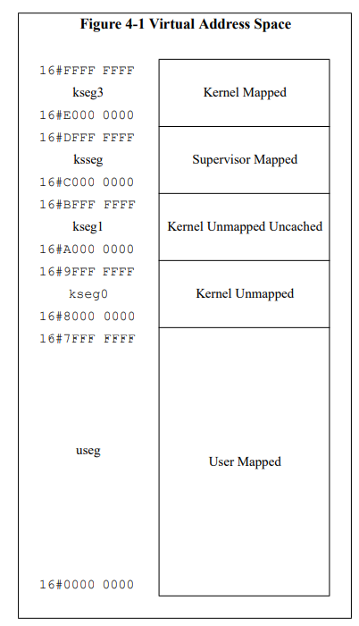

 

 图中所谓的Mapped段，指的是需要根据页表进行映射的段，而Unmapped段不依赖页表，是固定的地址映射关系。其中的Uncache段会在下一节讲述，现在你可以简单的理解为，供给外设使用的一段地址空间。在计组课设的要求中，由于不要求大家实现虚拟存储，要求实现的映射关系如下。

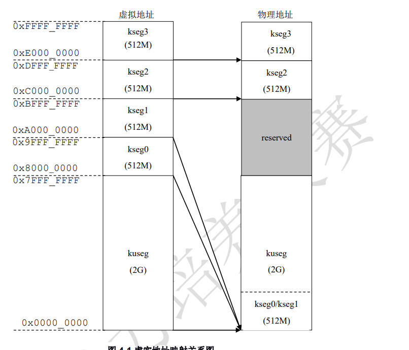

kseg1/kseg0是两段作为Unmapped段，其逻辑地址映射方式是固定的，称为固定地址映射，对于固定地址映射，实际上就是对地址的最高位进行一个替换，相当于做一个减法。kseg1/kseg0这两段空间映射到同一段物理地址空间，也就是0x00000000-0x1fffffff这段。通过这种方式，相当于通过地址的高位区分一个访存指令要访问的是外设还是存储。kseg0/kseg1/kseg2/kseg3段一般提供给操作系统内核使用，这2GB的地址空间一般称为内核地址空间。也正因如此，计组课设规定TinyMIPS的复位地址是在0xBFC00000，该地址事实上位于kseg1段。

> 一般来说，操作系统启动需要先执行一段Bootloader的代码，将操作系统内核加载到内存当中，从而实现操作系统的启动，这段Bootloader代码并不存放于内存当中（内存是易失性存储介质），而是存放在另一块存储设备里，并不连接到内存总线当中，（一种是实现是，这块存储设备可能是SPI Flash，CPU通过访问SPI控制器去访问Flash芯片）。对于CPU来说，bootloader代码往往位于外设上，所以启动地址位于0xBFC00000这样一个Uncache，Unmapped的地址。

?> 在Start.S中，有下面这样一段代码，请你解释它的含义

```assembly
	LA (t1, kseg1_kseg0) 
    LI (t2, 0x20000000)  
    subu t9, t1, t2      
    JR (t9)              
    nop                  
kseg1_kseg0:
inst_test:
    jal n1_lui_test      
    nop
    jal wait_1s
    nop
```

### AXI总线

一个计算机系统不会只有CPU，他往往有着多种多样的设备。外设，内存，CPU通过总线互联在一起，构成一个可以相互通信的网络，没有总线，计算机系统的各个部件就只是一个无用的半导体电路，而有了总线，才能将这些部件连接起来，构成计算机系统。

总线的种类很多，今天这里要介绍的是ARM公司推出的AXI总线，AXI(Advanced eXtensible Interface)总线隶属于AMBA系列总线。今天主要介绍的这种总线协议是AXI 4 总线协议。

#### 异步总线与握手

AXI 4协议本身相当复杂，我们还是从简单的情形开始看吧。

我们先看读数据的情形。CPU设计中常见的一种存储器是同步RAM，意味着该RAM与时钟同步，当访存请求发出后，在若干个时钟周期之后，可以拿回所需的数据。

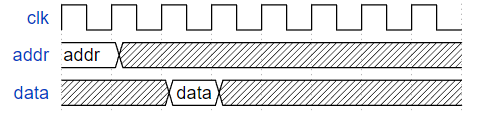

然而，CPU所访问的各类外设速度差异巨大，所以，外设需要有一种机制，告知CPU，外设提供的数据已经准备完成。这里可以引入一个valid信号，该信号使能时，则认为数据有效，可以被CPU接收。

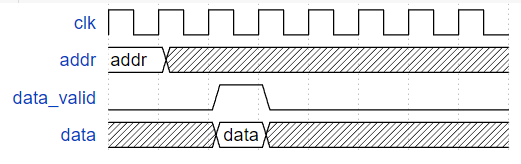

然而，CPU每时每刻都在处理着各种各样的请求，如果data有效时，CPU并未准备好接收数据呢？所以我们的CPU也需要一种机制，告诉外设，我已经准备好可以接受数据。

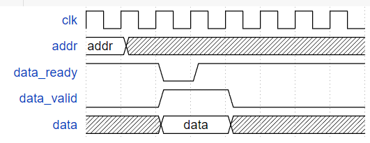

这样，当CPU准备好，当外设的数据有效时，这一次的数据传输才真正有效。valid和ready信号我们称为握手信号，valid信号由数据的发送方提供，ready信号由数据的接收方提供。当ready和valid都使能时，称为一次握手。一次握手标志着一次数据传输有效。

CPU提供的地址是否也永远有效呢？外设是否永远准备好接受新的请求呢？答案显然是不，所以，对于addr，我们也需要给一对valid，ready信号。

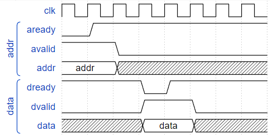

每一次数据发送都需要一次握手，无论是CPU向外设发地址，又或是外设向CPU发数据。

##### AXI 总线简述

此时我们的读总线模型已经非常接近AXI总线的总线的形式。现在让我们来正式的认识一下AXI吧。在这里，我们将计算机硬件系统中各个部件划分为两大类，主机和从机，比如CPU就是一个主机，它可以向从机发起读写请求，对从机进行数据读取和数据写入。而从机，则是根据主机受到主机的控制，响应主机的读写请求，比如内存就是从机。

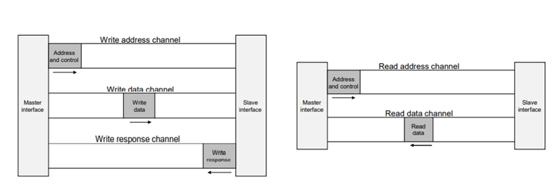

AXI 4 协议一共有五个通道，分别是AR，R，AW，W，B。每个通道传输一组数据，比如AR（address read）通道，是主机向从机发送读地址的通道。主机通过在读地址发送一个数据通道，此后就可以在R（read）通道读回数据。类似的，主机可以通过AW（address write）通道向从机发起写请求，待从机响应后，就可以通过W通道向从机发送要写入的数据。剩下的B通道称为Write Response Channel，写响应通道，指的是主机的写入请求已经真正实现。

对于每个通道来说，最基本的信号就是该通道的数据信号（包括地址AxADDR，数据AxDATA，对发送属性的控制），以及相应的握手信号（xxREADY,xxVALID），握手成功，以为该通道的一次发送结束。

以读数据为例，当地址ARADDR已经准备完毕，此时会使能ARVALID信号，从机看到ARVALID的信号后，就会知道主机发起了一次读地址的传输，当从机准备好响应该请求时，从机会拉高ARREADY信号。当ARVALID和ARREADY信号同时使能，意味着一次发送成功，主机从发地址转到读数据的状态，从机从接收地址响应状态，转换到发送数据状态。此后，从机发送数据，主机读取数据，一次握手之后，一次读取任务完成。

#### Brust 突发传输

一般来说，当我们的主机CPU通过AXI去访问内存时，都会经过非常多的时钟周期才能得到内存的响应。所以得到内存的一次响应是需要付出高昂的时间代价的，既然一次响应需要这么久的时间，我们是否能让一次响应，传回更多的数据，从而将这高额的时间成本均摊到每一个数据之上呢？

这种机制在AXI总线里称为Brust突发传输。在一次地址响应后，读取或写入多个数据，如下图所示，

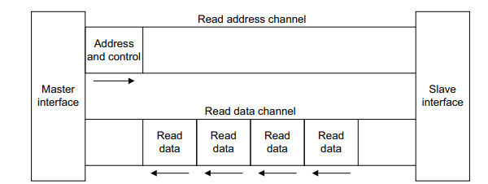

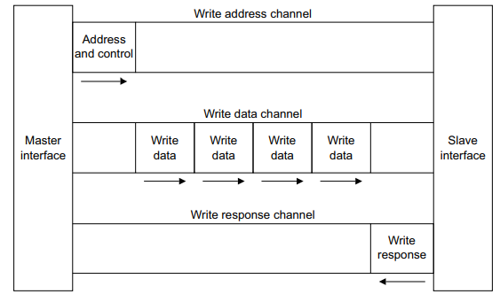

这组数据中的每一个数据我们称为一个Beat，这种机制，依赖于发送地址的AR/AW通道中的一些信号。AxLEN，AxBRUST，AxSIZE，其中

* AxBRUST：Brust传输的类型，主要是确定地址增长的方式，比如INCR模式是指访问从机中地址连续递增的一段空间。
* AxSIZE：指的是一个Beat的大小
* AxLEN：指的是一次传输过程中，Beat的数量

#### 互联

真实的计算机系统可能像下面这样（其实已经相当简化），有着许许多多的从机，许许多多的主机。

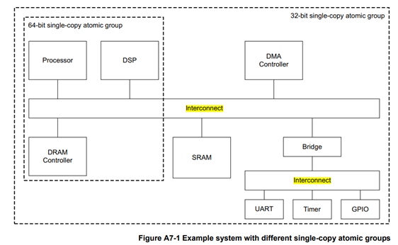

多个主机访问总线时，谁可以得到总线的响应呢？这就需要总线仲裁器Arbiter。仲裁器根据一定的调度算法，选择一个主机进行响应。

多个从机都在总线上，当一次发出读写请求时，究竟哪个从机需要响应呢？这就是根据连接在总线上的从机的地址空间进行访问，比如发现访问到的地址空间段时属于GPIO，就会将地址发送到GPIO处。

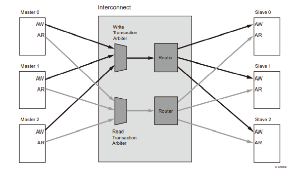