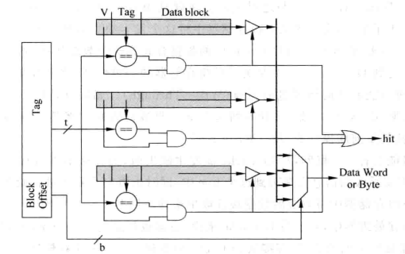
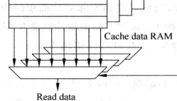
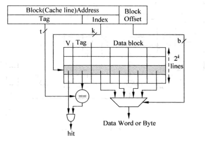
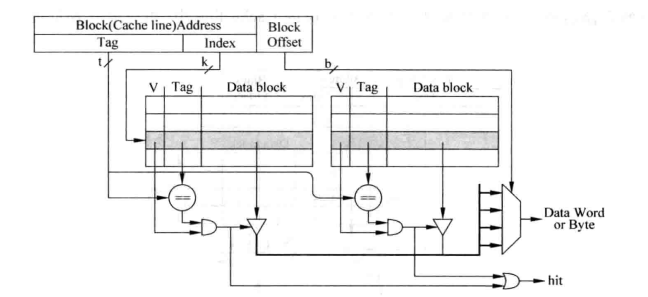

## Cache原理与设计

如果你曾有心观察过TinyMIPS的仿真波形，你或许会发现，TinyMIPS执行一条指令的周期其实远远长于五个周期。这是因为TinyMIPS通过AXI接口访问内存时，会需要耗费多个周期的时间，等待存储器响应访存请求。面对这种需要多周期才能返回的访存操作，当处理器发出的访存请求尚未被接受时，处理器采用的策略是进行暂停。因而，在TinyMIPS的运行过程当中有大量的时间会耗费在因为访存而引起的暂停上。

在真实处理器中，CPU对存储的访问也会耗费大量的时间。CPU运行的太快，存储器访问的太慢，因而存储器成为了制约处理器发展的关键路径。对此，计算机科学家们提出了两种主要的方案，缓存和预取。

预取策略是提前发出访存请求，通过此种方式可以一定程度上隐藏访存的时延，然而对于我们的TinyMIPS来说，预取实现的效果有限：访存时延相较于指令执行时间长得多。

缓存策略则是将一部分的数据项存入CPU上的高速存储单元上，这些访问速度更快，往往很短的时钟周期就可以获取到数据，存储单元中存储了CPU经常使用的数据项。对于TinyMIPS来说，实现缓存可以很大程度上提升处理器的性能。

现代的处理器中，往往是两种策略同时使用，尽可能将CPU访问存储器的成本降低。

### 局部性原理

局部性原理是计算机系统中的重要原理。包括时间局部性和空间局部性。

所谓时间局部性是指，存储器中的一个数据如果被访问了，那么，以后很可能会再次访问该数据。时间的局部性有很多例子，比如程序中常见的循环结构，一段时间内指令访问都会集中于对循环体内指令的访问。当我们访问变量时，一个变量往往还会在后面被重新使用。

所谓空间局部性是指，存储器中的一个数据如果被访问了，那么，它周围的数据也很可能被访问到。在取指时，当我们访问了一条指令时，大概率会访问其后的那条指令。当我们访问呢全局数组，或是栈上的内存空间时，也很大程度上会访问到一段连续的地址空间。

### 高速缓存

缓存（Cache）是一种广泛用于计算机系统中的方法，将需要耗费高额成本获取的数据存放在一个易于访问的地方。比如说Vivado的工程中就有对于IP的Cache，QQ微信等软件中也有对于网络下载的图片的Cache，操作系统中也会有对文件的Cache。

所以，计算机访问存储器需要耗费巨大的时间，将内存数据的一部分备份到一种高速存储介质中是一种很容易想到的方法。那么，放在什么地方呢？

很容易想到的一种介质就是寄存器堆。寄存器堆可以在当拍返回数据，访问速度极快。但是如果我们想要缓存更多的资源，也就意味着更大的寄存器堆和更差的时序，因为我们的读写的控制逻辑变得复杂了（想想寄存器堆对应的电路）。另一方面，一位的寄存器耗费的硬件资源也比较高，往往需要耗费较多的晶体管才能组成一个一位的寄存器。在一般的CPU中，片上的高速缓存采用的往往是SRAM，他占用的面积更小，一般来说其时序也更好。

在FPGA上，我们可以考虑使用其片上专用的存储资源BRAM（Block Random Access Memory）。对于大容量的存储，采用BRAM在时序上更有优势，可以生成更高性能的电路。但是BRAM的访问往往需要一个周期，即发出访存请求后，会在下一个周期内才会返回结果，在用BRAM做Cache的时候一定要注意这一点。

### Cache是一张表

根据空间局部性原理，我们使用一个数据项后，我们往往会使用到其相邻的数据项，因此，我们把内存划分为若干的Block，每个Block内有多个数据。当我们讨论内存数据在Cache中的存储时，我们实际上时讨论各个Block在Cache中的存储。

Cache事实上就是一张由Block中数据组成的表，当处理器访存时，会去访问Cache表，读取Cache表中的数据。在数据之外，每个Block还需要一些其他的元数据，这些元数据会帮助处理器确认Cache与内存中数据的映射关系。试想一下，Cache不过是处理器中的一个容量非常小的存储单元，Cache的容量往往只有KB级别，然而内存的空间则是GB级别。Cache与内存的巨大容量差异巨大，因此Cache这张表中，每个表项可以存放来自不同内存单元的数据，决定每个表项能放什么数据，将Cache的结构划分成三种基本结构——全相联Cache，组相联Cache，直接映射Cache。

#### 全相联Cache

我们首先考虑一种简单的Cache——全相联Cache。但处理器访问Cache的一个Block时，如何确定这个Block是内存中的哪个单元呢？答案很简单，只需要将该Block的地址也存在Cache表当中，作为元数据即可，我们这个地址称为Cache的tag。当我们访问Cache时，通过与该地址进行比较，即可判断这个Cache块是否是我们需要找的。除了tag之外，cache中还需要另一种元数据，该数据是Valid位。当我们处理器复位时，如果不对Cache进行初始化（加载一些内存数据到Cache当中），Cache中的每一项都是无效的，为了表示这种无效状态，我们需要Valid位，当访问Cache的一个Block时，我们会比较当前需要访问的地址和Cache表的Valid位，判断该项是否为我们需要的Block。

对于由一个Block，TAG，Valid位构成的Cache表中的一行，我们称之为一个Cache line。一个全相联Cache中绝不会只有一个Cache line，当我们访问一个全相联Cache时，要如何判断Cache中是否有我们需要的数据呢？显然，必须要将这多个Block的TAG都去做一遍比较，在硬件上，就是多个并行的比较器。然后我们根据每个比较器的结果的或，判断Cache是否命中。然后，根据命中的结果，从多个Cache的Block中选出一个数据。



可以看到，上图将一个访存地址划分成为了两个部分，一个是TAG，一个是Block Offset。我们前面提到，一个Block中会存放多个字的数据，所以访问一个Block时，需要判断的是Block的地址。然后只需要根据Block Offset就可以判断出，该访存地址到底需要的是Block中的哪个数据。



全相联Cache的一般会设计的比较小，因为如果设计的太大，意味着更多的TAG比较器，更高的时延和更大的开销。

#### 直接映射Cache

为什么全相联Cache需要如此之多的比较器呢？因为处理器的访存请求可能在全相联表中的任何一个Cache line中，那么，如果我们有一种方式，让一个Block只能存放在Cache表中的固定位置，这样每次去比较时，就只需要取出对应位置的tag，然后使用一个比较器就可以判断是否命中。

那么如何判断一个Block应该放在Cache表的哪里呢？这就可以引入直接映射Cache。

直接映射Cache将TAG段的尾段称为index。通过index指示，该地址想要访问的Block究竟在Cache表中的哪一行。



因此，当我们访问Cache时，首先会根据访存地址得到Tag和Index，然后我们会根据Index找到要访问的Cache line，然后将访存地址tag与该cache line中的tag进行比较，判断是否一致且该cache line是否有效。

Index的宽度事实上受限于我们的Cache大小决定，如果Cache有64个line，那么index的宽度就应该是6。

直接映射Cache非常简单，一个数据项在Cache表中位置是固定的，所以直接相连Cache甚至没有替换算法，当两个数据项的地址在Cache表中对应着同一个位置时，新来的数据项就必须要将旧的数据项替换掉。

但是如果有下面这样一种情形，CPU频繁访问的两个数据项，映射到了Cache中的同一个位置，此时就会触发频繁的Cache替换，这种现象我们称为抖动。

#### 组相联Cache

既然Cache表的任意位置都可以随意放置的全相联Cache访问效率上会比较低，而直接映射这种Block只能位于Cache表一处的Cache会导致抖动问题。那么是否可以考虑折中一下，让一个Block可以放在Cache表中的固定几个位置。

组相联Cache就是这样一种Cache，组相联同样通过index来确定一个Block存放的位置，但是同一个Index，可以有多个可以存放的位置，每一个位置都可以放一个Cache line，这些Cache line称为一个Cache Set。

组相联Cache可以理解为多个直接相连Cache的组合，每个这样的直接相连Cache，称为一个Cache way。如果一个index对应的数据能够放到n个位置上，就称其为n路组相联。下面是一个二路组相联的例子。



一般来说，Cache的way的数量越多，其抖动的现象越会减轻，但相应的Cache的访问效率也会降低。在Cache的大小一定时，当2^Index = n时，组相联Cache就会演变为全相联Cache，而当n=1时，Cache就会演变为直接映射Cache。

### Cache一致性与Uncache

Cache能够一定程度上解决存储器速度与主存之间差异过大的问题，然而Cache也引入了新的问题，也就是一致性问题和对于外设访问的问题。

### Cache的代码实现

下面我们来指导大家实现一个直接相连Cache

```verilog
module (
    //对CPU
    input en,
    input cpu_addr,
    output cpu_data
    output valid,
);
    
endmodule
```

